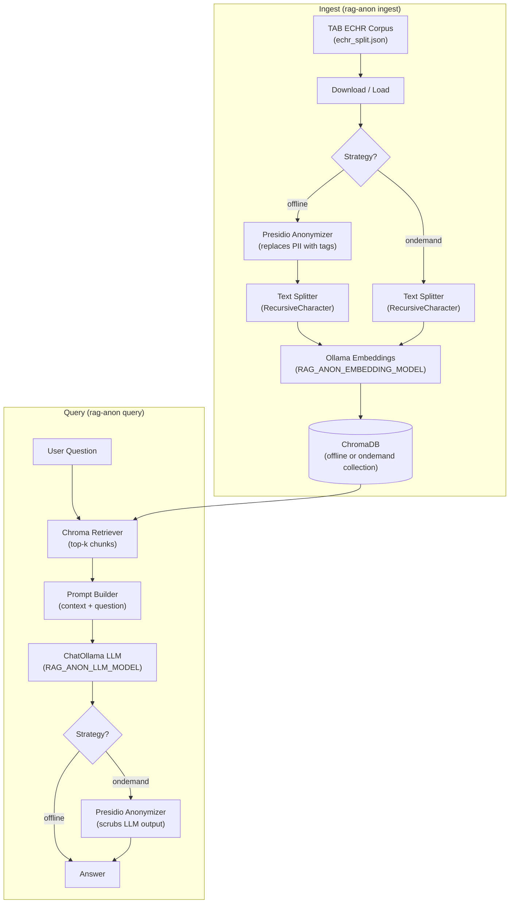

# rag-anonymous

RAG pipeline with Offline/On-Demand anonymization.

## Architecture

The pipeline supports two anonymization strategies controlled by `RAG_ANON_ANONYMIZER_STRATEGY`.
In **Offline** mode, PII is removed from the corpus before indexing so vectors and retrieved context are always redacted.
In **On-Demand** mode, raw text is indexed and only the final LLM answer is anonymized at query time.




## Project structure

```
rag-anonymous/
├── pyproject.toml          # Package metadata, dependencies, rag-anon entry point
├── rag_anonymous/
│   ├── __init__.py
│   ├── config.py           # Load env vars
│   ├── cli.py              # rag-anon ingest|query
│   ├── anonymizer.py       # Presidio-based PII anonymization
│   ├── ingest.py           # Corpus download, anonymization, chunking, indexing
│   ├── log_config.py       # Logging setup
│   └── query.py            # RAG chain and retrieval
├── data/                   # Cached TAB corpus (echr_*.json)
├── chromadb/               # Vector store persistence
├── docker-compose.yml
├── Makefile
└── .env.example
```

## Setup

### 1. Ollama

The pipeline talks to Ollama over its HTTP API at `RAG_ANON_OLLAMA_BASE_URL` (default `http://localhost:11434`). Two equivalent ways to bring it up — pick one:

**Option A — Native CLI / desktop app** (install from [https://ollama.com](https://ollama.com)):

```sh
ollama serve                      # or just launch the Ollama desktop app
make ollama-pull-models           # pull models via the host CLI
```

Both paths expose the same API on port `11434`, so the rest of the pipeline doesn't need to know which one is running. **Don't run both at once** — they'll race for the port and the second one will fail to bind.

**Option B — Docker** (uses `[docker-compose.yml](./docker-compose.yml)`):

```sh
make docker-up                    # start the ollama container
make docker-ollama-pull-models    # pull models inside the container
make docker-down                  # stop the container when done
```

### 2. Python package

```sh
python3.12 -m venv .venv
source .venv/bin/activate
pip install -e .
cp .env.example .env
```

`pip install -e .` reads `pyproject.toml` and installs the `rag_anonymous` package locally in editable mode. Nothing is published to PyPI.

## Usage

The CLI takes no flags — all knobs come from environment variables (typically `.env`). Override individual variables inline when needed.

### Ingest corpus

- **Offline:** Anonymizes the TAB corpus before indexing (PII replaced by tags in stored chunks).
- **On-Demand:** Indexes the corpus as-is (raw text); anonymization is applied to the LLM answer at query time.

Reads `RAG_ANON_ANONYMIZER_STRATEGY` and `RAG_ANON_CORPUS_SPLIT` from env:

```sh
make ingest
# or override inline:
RAG_ANON_ANONYMIZER_STRATEGY=ondemand RAG_ANON_CORPUS_SPLIT=train make ingest
```

Equivalent direct CLI:

```sh
rag-anon ingest
```

### Query

Reads `RAG_ANON_ANONYMIZER_STRATEGY`, `RAG_ANON_RETRIEVAL_K_DOCS`, and `RAG_ANON_QUERY_QUESTION` from env. Use the same strategy as at ingest time so the correct collection is queried. For `ondemand`, the generated answer is anonymized before being returned.

```sh
RAG_ANON_QUERY_QUESTION="What did the applicant complain about in case no. 13146/02?" make query
# override more variables:
RAG_ANON_ANONYMIZER_STRATEGY=ondemand RAG_ANON_RETRIEVAL_K_DOCS=10 RAG_ANON_QUERY_QUESTION="..." make query
```

Equivalent direct CLI:

```sh
RAG_ANON_QUERY_QUESTION="..." rag-anon query
```

## Configuration


| Variable                        | Default                  | Description                                                                                                                                                                                                                      |
| ------------------------------- | ------------------------ | -------------------------------------------------------------------------------------------------------------------------------------------------------------------------------------------------------------------------------- |
| `RAG_ANON_ANONYMIZER_ENTITIES`  | `PERSON,LOCATION,...`    | Presidio entity types                                                                                                                                                                                                            |
| `RAG_ANON_ANONYMIZER_STRATEGY`  | `offline`                | Anonymization strategy (`offline` or `ondemand`)                                                                                                                                                                                 |
| `RAG_ANON_CHUNK_OVERLAP`        | `0`                      | Text chunk overlap                                                                                                                                                                                                               |
| `RAG_ANON_CHUNK_SIZE`           | `200`                    | Text chunk size                                                                                                                                                                                                                  |
| `RAG_ANON_CHROMADB_PERSIST_DIR` | `./chromadb`             | Vector store persistence directory                                                                                                                                                                                               |
| `RAG_ANON_CORPUS_SPLIT`         | `dev`                    | TAB split (train/dev/test)                                                                                                                                                                                                       |
| `RAG_ANON_EMBEDDING_MODEL`      | `nomic-embed-text`       | Embeddings model                                                                                                                                                                                                                 |
| `RAG_ANON_LLM_MODEL`            | `qwen3:0.6b`             | Generator model                                                                                                                                                                                                                  |
| `RAG_ANON_LLM_REASONING`        | `false`                  | Maps to `ChatOllama(reasoning=...)`. `false` disables thinking via Ollama's `think` flag (faster, cleaner output). Set to `true` only when running a reasoning-capable model and you want `<think>` content captured separately. |
| `RAG_ANON_LLM_TEMPERATURE`      | `0.0`                    | Generation temperature                                                                                                                                                                                                           |
| `RAG_ANON_LOG_LEVEL`            | `INFO`                   | Application loggers / root level. Accepts `DEBUG`/`INFO`/`WARNING`/`ERROR`/`CRITICAL` or a numeric level. Also picked up by `rag-anonymous-metrics`.                                                                             |
| `RAG_ANON_LOG_LEVEL_HTTP`       | `WARNING`                | Level for the HTTP client loggers (`httpx`, `httpcore`, `urllib3`). Set to `INFO` to see every Ollama HTTP call.                                                                                                                 |
| `RAG_ANON_LOG_LEVEL_PRESIDIO`   | `ERROR`                  | Level for `presidio-analyzer` / `presidio-anonymizer` loggers. The default suppresses the noisy startup banner; raise to `INFO` to debug recognizer issues.                                                                      |
| `RAG_ANON_OLLAMA_BASE_URL`      | `http://localhost:11434` | Ollama API endpoint                                                                                                                                                                                                              |
| `RAG_ANON_QUERY_QUESTION`       | `""`                     | Question used by `rag-anon query`                                                                                                                                                                                                |
| `RAG_ANON_RETRIEVAL_K_DOCS`     | `5`                      | Retrieved chunks per query                                                                                                                                                                                                       |


